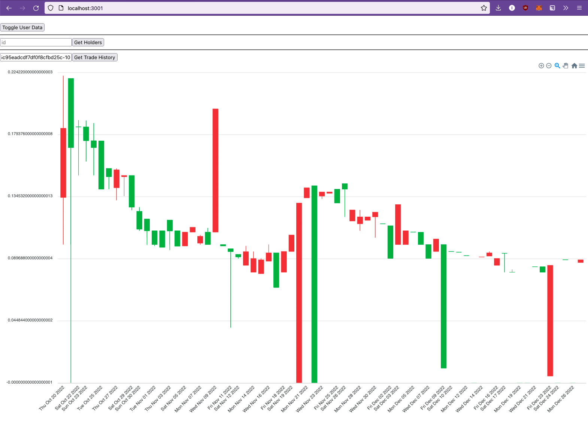

# GMS

My playground for querying & visualizing wallets & trades on from Loopring / GameStop Marketplace.

## Example

Historical trade price of an NFT

*(It's ugly, I just wanted to hack something quick together)*

## Run locally

`npm start`

Runs the app in the development mode.\
Open [http://localhost:3000](http://localhost:3000) to view it in your browser.

The page will reload when you make changes.\
You may also see any lint errors in the console.

## Thanks to

A lot of the queries I copy pasted from this project: <https://github.com/fudgebucket27/Lexplorer>
